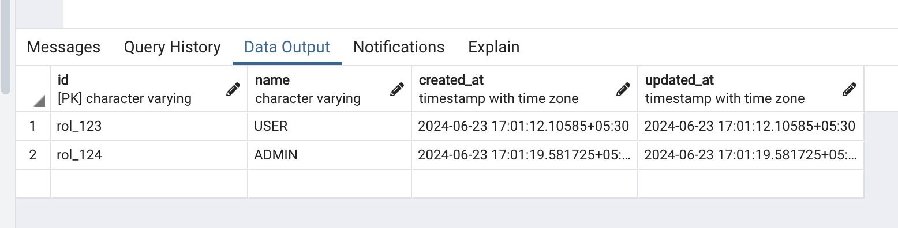

# Loan App

It is an app that allows authenticated users to go through a loan application. It doesn’t have to contain too many fields, but at least “amount
required” and “loan term.” All the loans will be assumed to have a “weekly” repayment frequency.
After the loan is approved, the user must be able to submit the weekly loan repayments. It can be a simplified repay functionality, which won’t
need to check if the dates are correct but will just set the weekly amount to be repaid.

## Getting Started

### Prerequisites

The following are the tools and packages required for local development:

1. Install and setup Golang local development environment.
1. Install and setup Postgres
1. Install and setup Ruby (Use `rvm` to manage ruby version)

### Project Setup

1. Clone the repo to your local machine

    ```sh
    > git clone https://github.com/goProjects/loan_app.git
    ```

1. Create a dev environment file from the sample file

    ```sh
    > cp env.sample development.env
    ```

   Modify the values in `development.env` to match your needs.

1. Use helper bash script to run locally

    ```sh
    > bash ./scripts/run-local-server.sh
    ```

### Running Test Suite

Create a dev environment file from the sample file

   ```sh
   > cp env.sample test.env
   ```

Modify the values in `test.env` to match your needs.

Use helper bash script to run tests

```sh
# install gotestsum
> go install gotest.tools/gotestsum@latest
```

```sh
> sh ./scripts/run-local-tests.sh

# Alternatively, you can also run all the tests from the project root
> go test -v ./...

# Also, for running specific tests,
# use -run flag while running the test from the package path
> go test -v -run <test_name>
```

## Schema Migrations

### Applying Migrations

Once the local postgres database as been set up, run the following commands to apply the migration

```sh
> cd migrations

# Install the dependencies from the GemFile
> bundle install

# skip this command if the database has already been created
> bundle exec rake db:create

# Run the migrations
> bundle exec rake db:migrate

# Rollback the rollback
bundle exec rake db:rollback
```

Check out the documentation on [Active Record Migrations](https://guides.rubyonrails.org/active_record_migrations.html)
for more information on creating, running and changing migrations.

### Adding New Migrations

```sh
> cd migrations
> bundle install
> bundle exec rake db:migrate:new name=InitSetup
```

## Code formatting

To ensure lint/format rules are maintained, run the following on the codebase prior to committing files

```sh
# Fixing formatting issues
> go fmt ./...

# Lint checking using golangci-lint (https://github.com/golangci/golangci-lint)
> golangci-lint -D errcheck run
```

## Thumb Rules

To be added as and when needed.

## Assumptions

- Have created installments and their due date calculation on approval of loan rather than creation
- Remainder loan amount is distributed over all the last remaining loan installments instead of just last one. Generally in my opinion, initial installments should have the extra remainder amount. Can be tweaked as needed.
- one_time_settlements table exists in separate repayment system
- Cents is used as lower denomination. It can be tweaked as needed.
- Seed role as needed.

## Pending things to add

## Apis

Refer postman collection for list of all apis

## Roles Seeded


